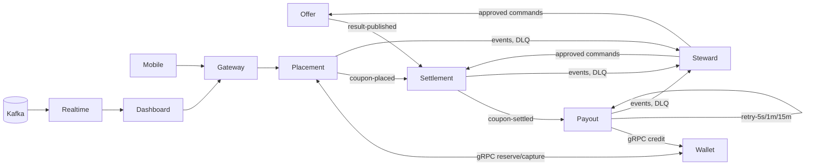

# SwiftBets - Plan

Status: approved 30 Sep 2026 with changes 1-4 (see `DECISIONS.md` D28-D31). Phase 0 in progress.

---

## A. Feedback on the brief

### A1. Where I disagree, and what I would do instead

1. **Target .NET 10 LTS, not .NET 8.** .NET 8 leaves support on 10 Nov 2026, about six weeks from today. If the showcase ships on a runtime that is about to go end-of-life, the first thing a reviewer will do is flag it. .NET 10 is the current LTS (supported to Nov 2028). The Dapper, Polly v8, Confluent.Kafka, Testcontainers, DbUp and Akka.NET 1.5 packages all support it, so the architecture stays the same. *(Question Q3.)*
2. **Use React 19, not React 18.** 19 is the current stable. TanStack Query 5, React Router 7 and Testing Library all target it, and Expo's current SDK already ships React 19. If the dashboard stays on 18, it and the mobile app run two React majors side by side.
3. **The wallet ledger should run as its own process, even though it lives in the placement repo.** If the wallet is only an in-process module, the placement saga never crosses a network boundary. That makes the kill-mid-saga, wallet-outage and duplicate-debit tests weaker than they look. I will keep the wallet code in `swiftbets-placement` but deploy it as a separate host (`Wallet.Api`) with its own database and database login. The wallet is exposed over **gRPC** (proto in `swiftbets-contracts`), consumed by placement and payout; its only HTTP surface is the operator top-up. Payout calls the same gRPC service, so the Phase 2 "wallet outage" is real: stop the container and the ladder drains afterwards.
4. **No MediatR and no FluentAssertions.** Both moved to commercial licences in 2025. Use cases will be plain `I<Verb><Noun>Handler` interfaces. Test assertions will use xUnit `Assert` plus Shouldly (MIT). This also keeps the call graph readable without pipeline indirection.
5. **No stored procedures. SQL lives in embedded `.sql` resources, one per query, executed by Dapper.** In both reference systems most of the pain was procedure drift: `CREATE OR ALTER` copies, `ZZZ_` ordering, and the committed SQL not matching live. Keeping logic in tested C# while the SQL stays reviewable text removes that whole class of bug. Locking hints (`UPDLOCK`, `READPAST`) still live in the `.sql` files.
6. **Sign tokens with RS256 and publish a JWKS endpoint, not HS256 with a shared secret.** Only placement's identity module holds the private key; every other service validates against `/.well-known/jwks.json`. Both reference systems share a symmetric key across services, which lets any compromised service mint tokens.
7. **Migrations run as a one-shot migrator per service, not on app startup.** Startup migrations race once there are two replicas. Each service ships a `*.Migrator` console on DbUp, with a journal table. It runs as a compose one-shot and as a Helm `pre-install,pre-upgrade` Job.
8. **Serve `/metrics` with prometheus-net and use OpenTelemetry for tracing only.** The OTel Prometheus exporter is still prerelease, which breaks the "no experimental packages" rule. prometheus-net is the stable, boring choice. Traces go over OTLP to Tempo.
9. **Runbook retrieval should be small-to-big hybrid, not plain chunk RAG.** One of the reference systems measured naive chunk retrieval over a small corpus: it lost the exact lines an answer needed, and stuffing the whole document did better. Around 10 runbooks sit well under that threshold. I will still build pgvector as the brief asks, but in the shape that holds up:
   - index by section;
   - fuse vector and Postgres full-text scores with reciprocal rank fusion;
   - return the whole parent runbook on a hit, with section-level citations;
   - refuse below a relevance floor.

   A retrieval eval (question → expected runbook) proves hit rate in CI.

### A2. Gaps a senior reviewer would expect

- **An edge.** The brief has httpOnly cookies for the browser, bearer tokens for mobile, rate limiting and a SignalR feed, but no component that owns them. Resolved with two repos:
  - `swiftbets-gateway`: a YARP BFF (cookie-to-bearer, Redis-backed per-route rate limits, header stripping, a single origin);
  - `swiftbets-realtime`: a Kafka-to-SignalR bridge with typed, sequence-numbered deltas, a Redis backplane, and groups per fixture, coupon and `ops`.
- **A shared building-blocks library.** "One shared resilience library" also needs a home, along with the Kafka consumer base, outbox relay, correlation propagation, observability wiring, health checks and the error envelope. These are not contracts. If they sit in `swiftbets-contracts`, every consumer rebuilds whenever infrastructure code changes. Resolved: `swiftbets-building-blocks`, published as separate packages.
- **The bet domain.** Demo scope (change 1):
  - markets: 1X2, Over/Under 2.5, BTTS and Double Chance;
  - bet types: singles and accumulators only; system bets (k-from-n) and bankers are in the backlog (B6);
  - void legs (postponed or abandoned fixtures) drop out of the acca at odds 1.00;
  - a price-change policy at placement: accept equal or better, reject worse with the current price in the error;
  - offer version checks.
- **Result corrections.** "Priority-gated deltas" needs a definition. Each result carries `(resultVersion, priority)`, where correction outranks official, which outranks provisional. Stale or lower-priority results are ignored. A correction triggers resettlement, and payout moves only the delta.
- **Money and odds representation.**
  - Amounts are `long` minor units, one currency per deployment (ZAR by default).
  - Odds are exact `decimal(10,3)`.
  - Payouts round down to the minor unit, with one rounding function used everywhere.
  - Balances are guarded by `CHECK (Available >= 0)`.
- **A double-entry, append-only ledger.** Every movement writes two entries that sum to zero. The balance is a projection updated in the same transaction, and a reconciler continuously checks that sum(entries) equals the balance. This comes directly from the reference systems, where hand-maintained bucket columns drifted.
- **Contract evolution.**
  - Every event is wrapped in an envelope: id, type, version, occurredAt, correlationId, causationId.
  - Topic and type names carry the major version (`.v1`).
  - JSON Schemas are generated from the C# records and checked in; CI fails on a breaking diff.
  - Consumer-driven contract tests run against those schemas.
- **Explicit topic provisioning** from a checked-in `topics.yaml`, covering partitions, retention and compaction. Nothing is auto-created. Partition keys: `fixtureId` for offer and results, `couponId` for bets, settlement and payout.
- **A time abstraction.** `TimeProvider` everywhere, so the replay feed can compress a season and tests can control time. Sweepers, ladders and the reconciler all read the same clock.
- **Deterministic crash points.** "Reprocessing after crash" needs repeatable kills. An `IFaultPoint` port sits at named points (after wallet reserve, after SQL commit before offset commit, and so on). It is off unless `FaultInjection:Enabled=true`, never enabled in the `production` environment, and the same ports back the Phase 3 fault-injection endpoints.
- **An audit trail** for every Steward approval, rejection and executed remediation: who, when, the input hash and the result. The approval id doubles as the idempotency key on the command.
- **A trace backend.** OpenTelemetry is wired, but the stack has nowhere to send traces. Add Tempo to compose and the charts, with a Grafana datasource.
- **Demo reset and seed.** A single `make reset` that recreates databases, seeds users and wallets, re-provisions topics and restarts the replay from matchday 1. This is what makes the "stranger in 10 minutes" gate reachable.
- **A defined load profile.** "1M+ bets/day" works out to about 12 bets/s on average. The k6 profile will ramp to 150 bets/s sustained, 10x the average for a peak, with p99 placement latency under 250 ms on one node. That is the number the README will claim and Grafana will show.
- **Cashout** is in the reference-study list but in no phase. It is deferred explicitly; see A4.

### A3. Engineering risks, in build order

| # | Phase | Risk | De-risk |
|---|---|---|---|
| 1 | 0 | Contracts and building blocks are shared across 10+ repos, so versioning friction slows every change | Publish to GitHub Packages (NuGet + npm) from tags using semver. Services pin exact versions, and Renovate-style bumps are PRs. Keep a local folder feed for offline builds. |
| 2 | 0 | Redpanda and Confluent.Kafka protocol mismatch. One reference system had to pin an old client with `ApiVersionRequest=false`. | The first test written is a Testcontainers produce→consume→commit smoke test on the exact broker and client versions, before any feature code. |
| 3 | 0-2 | Testcontainers SQL Server is heavy (~1.5 GB image, 15-20 s start) and makes CI slow and flaky | One container per test assembly (collection fixture), Respawn between tests, image cached in CI, readiness waits on a real `SELECT 1`. |
| 4 | 1 | The outbox isn't atomic in practice. Both reference systems enqueued or deduplicated outside the business transaction. | The outbox row and business rows share one `SqlTransaction`, and a test asserts that a rolled-back transaction leaves no outbox row. Consumer inbox: the insert and the state change share one transaction, keyed by `(consumer, eventId)` with a unique index. |
| 5 | 1 | The saga sweeper races the live saga | Sweeper claims use `UPDLOCK, READPAST` with a lease and only touch intents past their deadline. Every wallet call is idempotent on the saga id, so a duplicate compensation is a no-op. |
| 6 | 2 | The retry ladder "sleeps" in practice, or loses messages on rebalance | Ladder consumers read `due-at` and `pause` the partition until it is due, never sleeping the thread. The offset commits only after the named step succeeds or is forwarded. Tested across a forced rebalance. |
| 7 | 2 | Redis counters diverge from SQL (duplicate increments, lost keys, eviction) | Lua scripts add to a token set and increment atomically, so a duplicate token is a no-op. SQL is the source of truth. The reconciler rebuilds counters from SQL and raises `stuck-coupon` when all legs are evaluated but the coupon is unsettled past a threshold. Redis runs with `noeviction`. |
| 8 | 3 | Model output is non-deterministic, so an "evidence-cited, correct report" can't be gated | Code verifies every cited evidence id against tool-call results: the model reads, code verifies. CI runs in replay mode on recorded transcripts. The live gate runs `make eval-live`, where each fault scenario must pass 3 consecutive live runs. |
| 9 | 4 | CSP nonces don't fit a static Vite build | nginx injects a per-request nonce: `sub_filter` replaces a placeholder with `$request_id`, and the CSP header carries `'nonce-$request_id' 'strict-dynamic'`. An E2E test asserts there are no CSP violations. |
| 10 | 4-5 | SignalR breaks behind an ingress (negotiate plus sticky sessions) | WebSockets only with `skipNegotiation`, a Redis backplane, and ingress timeouts documented in the chart. |
| 11 | 5 | The charts only work on one distribution | Plain `networking.k8s.io/v1` Ingress with a configurable `className`, no distro-specific CRDs, and `storageClassName` as a value. CI runs `helm lint`, `kubeconform`, and a full umbrella install on a `kind` cluster with a smoke test. |
| 12 | 5 | The SQL Server image is amd64 only, and the cloud cluster is the Oracle Always Free ARM VM (AMD free shapes cannot run this stack) | SQL Server is external in the cloud: Azure SQL Database free tier as the betstore, reached from the OCI k3s cluster over TLS (`Encrypt=True`), provisioned by an `azurerm` Terraform module alongside the OCI module. Local/compose and CI keep the amd64 SQL Server container. The connection string is plain config, so environments differ only by env/secret. Every SwiftBets image is multi-arch (amd64 + arm64); Postgres, Redis, Redpanda, Tempo, Prometheus, Grafana and all services run on the ARM node. The cloud Helm values have no SQL Server StatefulSet; the local values keep it. The `sql-transient` pipeline also covers Azure SQL transient errors (40613, 40197, 40501, 49918-49920) and serverless auto-resume. |
| 13 | 5 | Deploy-on-merge needs a cluster reachable from GitHub Actions | The deploy job uses a `KUBECONFIG` environment secret with manual-approval protection, and skips loudly when it is absent. |
| 14 | 6 | APK signing in CI | `expo prebuild` + Gradle `assembleRelease` in Actions (no EAS account needed). The keystore is a base64 secret, and the artifact is attached with `gh release`. |

### A4. Scope challenge

**Cut or defer (the showcase is no weaker):**
- Cashout, in-play betting, multiple sports, KYC and real deposit providers. Wallets are seeded, and an operator top-up endpoint covers demos.
- System bets (k-from-n) and bankers (change 1), moved to the backlog (B6).
- iOS builds.
- HPA everywhere. HPA goes only on placement API, settlement workers and payout workers, where lag or CPU actually drives scale.
- Terraform `apply` in CI. CI runs `fmt`, `validate` and `plan` against a documented remote state. Apply is a manual workflow.
- Loki. Serilog JSON goes to stdout, and Steward's "recent events" tool reads Kafka and SQL, not logs.

**Must not be cut:** the four money-path failure tests (duplicate message, out-of-order result, reprocessing after crash, wallet outage); the outbox and relay; the saga and sweeper; token-guarded counters; the ladder; the reconciler; Steward's approval loop with its audit trail; contract tests; the kind-cluster install test; Grafana dashboards under k6 load.

### A5. What the reference systems taught me

The best-rated API in the reference set is **SaCreators PaymentApi**. I studied it most closely, along with the MarketApp platform, Steward, Nestling and IncidentIt.

**Adopt:**
- **One handler per capability** (PaymentApi split `PaymentHandler` into deposit, tip and withdrawal handlers). SwiftBets gets one handler per use case with narrow dependencies.
- **Server-side enforcers for domain rules.** Constants such as minimum withdrawal and stake limits live server-side, the UI only mirrors them, and every mirror is named in the code.
- **Money writes follow the PaymentApi / MarketApp wallet pattern:**
  - a locked row read (`UPDLOCK, ROWLOCK`) or an app lock per wallet;
  - an idempotency key checked under the lock;
  - a `WasApplied` output, so compensation only reverses a debit that really happened;
  - atomic claims via `UPDATE ... WHERE Status IN (...)` plus a `@@ROWCOUNT` check.
- **Money writes are not cancellable; reads are.** A cancellation token honoured between debit and credit leaves money half-moved.
- **Lease-based outbox claims** (`READPAST, UPDLOCK, ROWLOCK`, batch plus lease), an `event-id` header, and "only the winner of the state transition publishes".
- **RFC 7807 ProblemDetails with a `correlationId`**, gateway header stripping (never trust inbound identity headers), and single-flight token refresh on clients.
- **Steward's AI practice:**
  - native Anthropic API with prompt caching and a byte-stable system prefix;
  - a cost cap;
  - the model reads, code computes;
  - loud failures (no silent fallbacks, unparseable output stored as `error`).
- **IncidentIt's relevance gate and citations**, and **Nestling's single scrubbing decorator** around the model client.
- **The human approval queue** from Steward's admin top-ups: pending → approve/reject, an idempotent executor, and an audit row per decision.

**Avoid (each one cost real time in a reference system):**
- The outbox enqueue and the consumer dedup running outside the business transaction.
- Consumers that halt on one bad message, or commit offsets on failure. There were no DLQs.
- A stored, mutable balance with several buckets kept in sync by hand. Optional or time-bucketed idempotency keys. `IF EXISTS` dedup with no unique index.
- Webhooks that return 200 on error.
- Blanket Polly retries on non-idempotent POSTs, while the external provider clients had no policies at all.
- Four coexisting error shapes, and FluentValidation referenced but never used.
- JWTs with issuer and audience validation off, and a symmetric key shared across services.
- One database shared by every service, with manual migrations and no journal.
- In-memory rate limiting on a hard-coded path list.
- `unsafe-inline` / `unsafe-eval` in the CSP.
- No application metrics, and correlation ids that stop at the HTTP boundary.
- `:latest` tags, CI with no test gate, and artifacts or tokens committed to the repo.

---

## B. The plan

### B1. Repositories

Every repo includes a README with badges, a CI workflow that calls the reusable workflows in platform, a Dockerfile (multi-stage, non-root, distroless or chiseled runtime), `.gitignore`, `.env.example`, `Directory.Build.props` (nullable, analyzers, warnings as errors) and `global.json`.

Every .NET service has the same layout:

```
src/SwiftBets.<Svc>.Domain          pure: entities, value objects, domain services, no package refs
src/SwiftBets.<Svc>.Application     use-case handlers, ports (I*Repository, I*Client), DTOs, validators
src/SwiftBets.<Svc>.Infrastructure  Dapper repos + Sql/*.sql (embedded), Kafka, Redis, HTTP clients
src/SwiftBets.<Svc>.Api | .Worker   host: composition root, endpoints, options validation
src/SwiftBets.<Svc>.Migrator        DbUp console + Migrations/NNNN_description.sql
tests/*.Domain.Tests  *.Application.Tests  *.Integration.Tests (Testcontainers)  *.Contract.Tests
load/k6/<api>.js
```

A `ProjectReferencesTests` test fails the build if a reference points outward.

#### swiftbets-contracts
- **Responsibilities:** event records, API DTOs, error envelope, topic names; generated JSON Schemas and TS types.
- **Key components:**
  - `EventEnvelope<T>`, event records per domain (`...V1`);
  - `TopicName` (base plus env suffix);
  - `ErrorEnvelope` (RFC 7807 + `code`, `correlationId`, `errors[]`);
  - `Result<T, Error>`;
  - schema generator (NJsonSchema) and TS generator (NJsonSchema.CodeGeneration.TypeScript), plus `openapi-typescript` for the per-service API clients;
  - `protos/swiftbets/wallet/v1/wallet.proto`, packaged as `SwiftBets.Contracts.Grpc` (generated client and server stubs via Grpc.Tools).
- **Data owned:** none.
- **Produces:** the NuGet package `SwiftBets.Contracts` and the npm package `@swiftbets/contracts`.
- **Tests:** round-trip serialization, schema snapshots (CI fails on a breaking diff), versioning rules.

#### swiftbets-building-blocks
- **Responsibilities:** everything cross-cutting, published as separate packages:
  - `.Resilience`: named Polly v8 pipelines:
    - `idempotent-http`: timeout + retry on transient failures + circuit breaker;
    - `keyed-http`: retries only when an idempotency key is present;
    - `sql-transient`: deadlock 1205 and connection errors;
    - `kafka-produce`.
  - `.Messaging`:
    - producer with envelope and headers;
    - `ConsumerHost<T>`: validate → inbox + handle in one transaction → commit offset;
    - DLQ routing;
    - batch mode;
    - pause/resume for ladders.
  - `.Outbox`: transactional enqueue plus the claiming relay (lease, backoff, never drop).
  - `.Observability`: Serilog JSON, correlation middleware, Kafka header propagation, OTel tracing, prometheus-net, health checks.
  - `.Web`: ProblemDetails mapping from `Result` errors, security headers, JWT/JWKS validation, rate limiting.
- **Tests:** unit tests plus Testcontainers tests for the consumer host, outbox relay and ladder.

#### swiftbets-offer
- **Responsibilities:** replay real historical soccer fixtures, prices and results on a loop; the offer store; the read API; market suspension.
- **Key components:**
  - `Offer.Feed` (worker): loads a curated EPL season dataset (fixtures, opening and closing 1X2/O-U odds, results). The price path is interpolated from opening to closing prices. It runs on a compressed `TimeProvider` clock and loops seasons, and its fault hooks can emit a duplicate result or a result correction.
  - `Offer.Api`: `GET /fixtures`, `GET /fixtures/{id}`, `POST /markets/{id}/suspend` (Operator), `POST /markets/{id}/resume`.
- **Data owned:** Redis. One hash per fixture holding markets, prices and an `offerVersion`, plus a sorted set of fixtures by kickoff.
- **Produces:** `fixture-changed`, `price-changed`, `result-published`.
- **Tests:** replay determinism (the same seed gives the same stream), price interpolation, Redis store integration, result version and priority rules.

#### swiftbets-placement
- **Responsibilities:** identity (seeded users, RS256 JWT, JWKS, refresh rotation); coupon placement (sessions, validation, price-change policy, risk module, saga, outbox, relay); the wallet ledger (separate host); the bet-history read model.
- **Key components:**
  - `Placement.Api`: `POST /coupons` (`Idempotency-Key` required).
  - The saga:
    1. write the `SagaIntent`;
    2. check the offer (version and price) via Redis;
    3. run the risk module (stake min/max, max payout, per-fixture liability cap);
    4. `Wallet.Reserve`;
    5. persist the coupon, legs and outbox row in one transaction;
    6. `Wallet.Capture`;
    7. mark the intent complete.

    Compensation is `Wallet.Release`.
  - `OrphanSweeper`: claims expired intents and completes or compensates each one based on the wallet reservation's state.
  - `OutboxRelay`.
  - `Wallet.Api`:
    - gRPC service `swiftbets.wallet.v1.Wallet`: `Reserve`, `Capture`, `Release`, `Credit`, `Debit`, `GetBalance`, `GetReservation`, consumed by placement and payout; every mutating RPC carries an idempotency key;
    - HTTP only for the operator top-up (`POST /accounts/{id}/topup`) and `/health`, `/metrics`;
    - blacklist check on credits;
    - a double-entry ledger with a unique idempotency key.
  - `History.Projector` (worker, Postgres) and `GET /me/coupons`.
- **Data owned:**
  - SQL Server `SbPlacement`: users, sessions, coupons, legs, saga intents, outbox, inbox.
  - SQL Server `SbWallet`: accounts, ledger entries, reservations, idempotency, blacklist.
  - Postgres `sb_history`: coupon history projection.
- **Consumes:** `coupon-settled`, `payout-completed` (for history).
- **Produces:** `coupon-placed`, `coupon-rejected`, `ledger-posted`.
- **Tests:**
  - domain: price policy, risk limits, acca odds maths (void legs at 1.00);
  - application: saga transitions with fakes;
  - integration:
    - every repository;
    - an outbox rollback leaves no row;
    - the relay claims under concurrency;
  - **kill-mid-saga**: a fault point after reserve, then the host is stopped; the sweeper releases and the balance is restored;
  - **duplicate debit**: 20 concurrent requests with the same key produce 1 ledger debit; the rest get the stored response or `409 placement_in_progress` (D52);
  - **wallet outage during placement**: fails fast with a typed `wallet_unavailable` error and no orphaned reservation;
  - contract test: `coupon-placed` against the schema;
  - k6: placement and wallet.

#### swiftbets-settlement
- **Responsibilities:** index open legs by fixture; evaluate legs on results; settle coupons when all legs resolve; resettle on corrections; reconcile Redis against SQL; inbound DLQ.
- **Key components:**
  - `Indexer` (consumes `coupon-placed`, batch): writes the `(fixtureId, marketId) → legs` index.
  - `Evaluator`, stage 1:
    - consumes `result-published`;
    - applies the priority gate: `(resultVersion, priority)` above the stored result, otherwise it is a no-op;
    - evaluates each affected leg to won, lost or void;
    - writes the evaluation row and an outbox `leg-evaluated`.
  - `Settler`, stage 2:
    - consumes `leg-evaluated` keyed by coupon;
    - a Lua token-guarded counter (`SADD token` + `INCR` in one script, where the token is `legId:resultVersion`);
    - once the count equals the leg count, computes the payout (single or acca, voids at 1.00);
    - writes the settlement with its `settlementVersion` and an outbox `coupon-settled` carrying `targetPayout`.
  - `Reconciler` (timer): compares counters with the SQL evaluation rows, repairs from SQL, and raises `stuck-coupon` when a coupon is fully evaluated but unsettled past a threshold.
  - Inbound DLQ: validation or deserialization failures go to `*.dlq` with the original topic, partition, offset and error headers, then the offset is committed so the partition keeps flowing. Transient failures do not DLQ; they pause and retry.
  - Operator command: `POST /coupons/{id}/refresh`, which re-derives state from SQL and replays the settle step.
- **Data owned:** SQL Server `SbSettlement` (leg index, results, evaluations, settlements, outbox, inbox); Redis (progress counters and token sets).
- **Consumes:** `coupon-placed`, `result-published`, `leg-evaluated`.
- **Produces:** `leg-evaluated`, `coupon-settled`, `stuck-coupon`, `*.dlq`.
- **Tests:**
  - domain: every settlement outcome for singles and accas, including an acca with a void leg, an all-void acca (stake refund) and one losing leg;
  - **duplicate result** is a no-op;
  - **out-of-order results** (a correction before the official result, v2 before v1) end in the correct final state;
  - **reprocessing after crash**: a fault between the SQL commit and the offset commit, then a restart, gives no double counter and no double settlement;
  - **poison message** is parked while the next message on the same partition still settles;
  - **induced stuck coupon**: the Redis key is deleted, and the reconciler repairs it and raises the event;
  - Lua script unit tests against real Redis.

#### swiftbets-payout
- **Responsibilities:** turn settlements into wallet credits or debits by delta; a resumable retry ladder with named steps; dead-letter; blacklist.
- **Key components:**
  - `PayoutWorker`:
    - consumes `coupon-settled`;
    - `delta = targetPayout(version) - paidSoFar`;
    - the idempotency key is `{coupon}_{bet}_{type}_{version}`, with type one of `WIN`, `VOID_REFUND`, `RESETTLE_CREDIT`, `RESETTLE_DEBIT`.
  - The steps are named, never positional: `ComputeDelta → CreditWallet → RecordPayment → PublishCompleted`. Each retry message carries `step`, `attempt` and `dueAt`.
  - Ladder topics are 5s → 1m → 15m, then `payout.dead-letter`. Ladder consumers pause the partition until `dueAt`. An open circuit breaker routes straight to the next rung.
  - `CreditWallet` calls the wallet's gRPC `Credit`/`Debit` through the `keyed-grpc` resilience pipeline (deadline, retry only because the idempotency key is always set, circuit breaker).
  - Blacklisted wallets go straight to the dead-letter with the reason `wallet_blacklisted`, not the ladder.
  - `POST /dead-letters/{id}/replay` (Operator, audited).
- **Data owned:** SQL Server `SbPayout` (payment records per coupon and version, step state, inbox, outbox).
- **Consumes:** `coupon-settled`, the ladder topics.
- **Produces:** `payout-completed`, ladder topics, `payout.dead-letter`.
- **Tests:**
  - **wallet outage**: stop `Wallet.Api` mid-stream and assert the ladder depth rises; restart it and assert everything drains, with ledger credits equal to expected and zero duplicates by idempotency key;
  - resettlement delta (paid 50, corrected to 0, gives a debit of 50);
  - resuming at `RecordPayment` after a crash does not re-credit;
  - blacklist parks the message;
  - contract tests against `coupon-settled`.

#### swiftbets-steward
- **Responsibilities:**
  - detect anomalies;
  - diagnose with a tool-calling agent;
  - write incident reports with cited evidence;
  - approval-gated remediation;
  - fault-injection orchestration;
  - runbook RAG.
- **Key components:**
  - `Detector` (worker). Rules over Kafka streams and Prometheus queries:
    - `stuck-coupon`;
    - wallet circuit open or ladder depth;
    - DLQ count above zero;
    - duplicate settlement (the same coupon and version settled twice, or an idempotency-key conflict);
    - consumer lag and outbox backlog.
  - `Agent`:
    - the Anthropic Messages API with native tool use, behind an `ILanguageModel` port;
    - the system prompt and tool definitions are cached and byte-stable;
    - a bounded loop (at most 8 turns) with a cost governor.
  - Tools: `get_recent_events`, `get_coupon_state`, `get_service_metrics`, `search_runbooks`, `propose_remediation`.
  - `IncidentReport` schema:
    - `summary`, `severity`, `hypothesis`, `confidence`;
    - `evidence[]` (`toolCallId`, `ref`, `excerpt`);
    - `runbookCitations[]` (`runbookId#section`);
    - `proposedActions[]`.

    Code rejects any evidence reference that is missing from the tool results.
  - `Remediation`:
    - actions start as Pending;
    - an Operator approves or rejects;
    - the executor calls the target command (`settlement /coupons/{id}/refresh`, `offer /markets/{id}/suspend`) with the approval id as its idempotency key;
    - an audit row is written.
  - `Faults` API: stuck coupon, wallet outage, poison message, duplicate settlement. It proxies the per-service fault endpoints with the Operator role.
  - `Runbooks`: markdown in the repo; the ingestor chunks by section and embeds via an `IEmbeddingGenerator` port (Ollama `nomic-embed-text` locally, a deterministic hashing embedder in CI); hybrid pgvector + tsvector search with RRF.
- **Data owned:** Postgres `sb_steward` (runbooks, chunks, vectors, incidents, tool calls, reports, actions, audit).
- **Produces:** `incident-raised`, `incident-updated`, `remediation-executed`.
- **Tests:**
  - detector rules against synthetic streams;
  - agent loop in replay mode on recorded transcripts, with evidence-validation tests;
  - retrieval eval (hit@3 of at least 90% on a question set);
  - approval state machine;
  - executor idempotency;
  - `make eval-live` for the Phase 3 gate.

#### swiftbets-gateway and swiftbets-realtime
- **Responsibilities:** `swiftbets-gateway` is the single public origin; `swiftbets-realtime` is the real-time push. Two repos, two images.
- **Key components:**
  - `Gateway.Api` (YARP), in `swiftbets-gateway`:
    - `/auth/login` issues an httpOnly, Secure, `SameSite=Strict` cookie for browsers, and every mutation also requires an `X-Requested-With` header;
    - converts the cookie to a bearer token downstream;
    - passes mobile bearer tokens through;
    - strips inbound identity headers;
    - per-route rate limits in Redis;
    - security headers.
  - `Realtime.Api` (SignalR, Redis backplane), in `swiftbets-realtime`:
    - consumes Kafka;
    - groups `fixture:{id}`, `coupon:{id}`, `ops`, `risk`;
    - typed deltas with a per-group sequence number, so the client detects gaps and refetches.
  - A connection-count metric.
- **Tests:** route authorisation matrix, cookie/CSRF rules, rate limiting, a hub integration test (a Kafka event reaches a subscribed client).

#### swiftbets-dashboard
- **Stack:**
  - React 19 + TypeScript on Vite;
  - React Router 7;
  - TanStack Query for server state;
  - Jotai for small atom stores of UI state;
  - Tailwind v4 with a tokens file;
  - clsx;
  - the generated client from `@swiftbets/contracts`.
- **Features:** `live-feed`, `anomalies`, `incidents` (report, evidence, approve/reject), `faults`, `coupons`. Each feature follows `{components,hooks,api,state,types}`.
- **Real-time:** a single `RealtimeConnection` service with reference-counted `useGroup(...)` subscriptions. It is inert when `typeof window === 'undefined'` or in tests.
- **Auth:** a single 401 interceptor opens a re-auth prompt.
- **Serving:** nginx with a per-request CSP nonce.
- **Tests:** Vitest and Testing Library per component (loading, empty, error and success states). Playwright covers (1) login, live feed and a coupon appearing, and (2) inject fault, report, approve, recovered.

#### swiftbets-mobile
- **Stack:**
  - Expo (current SDK) with expo-router;
  - the same feature-folder structure;
  - TanStack Query and Jotai;
  - SecureStore for tokens;
  - single-flight refresh;
  - no secrets in the bundle (the API base URL is set at build time);
  - certificate pinning documented, with the config plugin noted.
- **Screens:** fixtures, market odds, betslip (singles and accas, price-change prompt), place bet, my bets.
- **Release:** a signed release APK via Gradle in CI, published as a GitHub Release.
- **Tests:** Jest + React Native Testing Library for the betslip and placement flow, plus a Maestro smoke flow documented.

#### swiftbets-platform
- **compose/**:
  - infrastructure: Redpanda + Console, SQL Server, Postgres with pgvector, Redis, Prometheus, Grafana, Tempo, Ollama (optional profile);
  - one-shot jobs: the migrators and topic provisioning;
  - all services, the dashboard, the gateway and realtime.
- **charts/**:
  - a `swiftbets-service` library chart (Deployment, Service, probes, resources, ConfigMap, Secret references, HPA, PDB, ServiceMonitor-free scrape annotations);
  - one thin chart per service;
  - an `infra` chart using official images: SQL Server (enabled in `values-local.yaml` only), Postgres with pgvector, Redis, and Redpanda through its official chart as a dependency;
  - the `swiftbets` umbrella chart with `values-local.yaml` (in-cluster SQL Server) and `values-cloud.yaml` (no SQL Server StatefulSet; betstore connection strings come from Secrets pointing at Azure SQL).
- **terraform/**:
  - `modules/oci`: VCN, subnet, security lists, the Always Free Ampere A1 instance, cloud-init that installs k3s;
  - `modules/azure-sql`: `azurerm` resource group, SQL server (TLS 1.2 minimum, firewall rule for the OCI egress IP only), and the free-tier betstore database(s);
  - the Kubernetes and Helm providers install the umbrella chart;
  - remote state in an OCI Object Storage S3-compatible backend, documented;
  - variables for shape and arch.
- **.github/workflows/**: reusable `dotnet-service.yml`, `node-app.yml`, `helm-deploy.yml`, `scan.yml` (Trivy on images, `dotnet list package --vulnerable`, `npm audit`, CodeQL).
- **grafana/**: dashboards as JSON for platform overview, money-path health and Steward incidents.
- **docs/**: DECISIONS, SECURITY (threat notes per service), ARCHITECTURE (Mermaid), runbooks index, PLAN.
- **landing/**: Astro static site with the animated architecture diagram.
- **scripts/**: `bootstrap.sh` (clone all repos), `make up | reset | load | eval-live`.

#### swiftbets-risk (Phase 8)
- **Responsibilities:** advisory real-time risk. It does not block placement; the placement risk module stays the hard gate.
- **Key components:**
  - Akka.NET 1.5;
  - one `FixtureLiabilityActor` per fixture, addressed through a `ShardRegion`-compatible message extractor so it runs on one node and is cluster-sharding-ready;
  - consumes `coupon-placed`, `price-changed` and `coupon-settled`;
  - liability per outcome;
  - pattern detectors: stake clustering, late-steam betting against price moves, correlated accas;
  - publishes `liability-changed` and `risk-alert`, which realtime pushes to the dashboard's `risk` group.
- **Data owned:** actor state with snapshots in Postgres (Akka.Persistence.Sql).
- **Tests:** Akka.TestKit per actor, plus a generator-driven integration test.

### B2. Cross-repo maps

**Topics.** The full name is `swiftbets.<domain>.<event>.v<N>.<env>`, for example `swiftbets.placement.coupon-placed.v1.dev`.

| Topic | Key | Producer | Consumers |
|---|---|---|---|
| offer.fixture-changed.v1 | fixtureId | offer | realtime, risk |
| offer.price-changed.v1 | fixtureId | offer | realtime, risk |
| offer.result-published.v1 | fixtureId | offer | settlement |
| placement.coupon-placed.v1 | couponId | placement (outbox) | settlement, history, realtime, risk, steward |
| placement.coupon-rejected.v1 | couponId | placement | realtime, steward |
| wallet.ledger-posted.v1 | accountId | wallet (outbox) | realtime, steward |
| settlement.leg-evaluated.v1 | couponId | settlement (outbox) | settlement |
| settlement.coupon-settled.v1 | couponId | settlement (outbox) | payout, history, realtime, risk, steward |
| settlement.stuck-coupon.v1 | couponId | settlement reconciler | steward, realtime |
| payout.retry-5s / -1m / -15m.v1 | couponId | payout | payout |
| payout.dead-letter.v1 | couponId | payout | steward, realtime |
| payout.payout-completed.v1 | couponId | payout (outbox) | history, realtime, steward |
| steward.incident-raised / incident-updated.v1 | incidentId | steward | realtime |
| steward.remediation-executed.v1 | incidentId | steward | realtime |
| risk.liability-changed / risk-alert.v1 | fixtureId | risk | realtime, steward |
| `<any>.dlq` | original | each consumer host | steward |

**APIs (public HTTP all behind the gateway; every mutation authorised server-side).**

| Service | Endpoints | Roles |
|---|---|---|
| placement/identity | `POST /auth/token`, `POST /auth/refresh`, `GET /.well-known/jwks.json` | public, rate-limited |
| placement | `POST /coupons` (Idempotency-Key), `GET /coupons/{id}`, `GET /me/coupons` | Punter |
| wallet (gRPC, internal only) | `Reserve`, `Capture`, `Release`, `Credit`, `Debit`, `GetBalance`, `GetReservation` | service tokens (placement, payout); `GetBalance` proxied for Punter via placement |
| wallet (HTTP) | `POST /accounts/{id}/topup` | Operator |
| offer | `GET /fixtures`, `GET /fixtures/{id}` | public |
| offer | `POST /markets/{id}/suspend`, `POST /markets/{id}/resume` | Operator |
| settlement | `POST /coupons/{id}/refresh`, `GET /coupons/{id}/state` | Operator, service |
| payout | `GET /dead-letters`, `POST /dead-letters/{id}/replay` | Operator |
| steward | `GET /incidents`, `GET /incidents/{id}`, `POST /actions/{id}/approve`, `POST /actions/{id}/reject`, `POST /faults/{kind}` | Operator |
| every service | `/health/live`, `/health/ready`, `/metrics`, `POST /faults/*` (non-prod only) | internal |

**Build dependency order:**
1. contracts
2. building-blocks
3. platform (compose, topics)
4. offer
5. placement (identity → wallet → placement → history)
6. settlement
7. payout
8. steward
9. gateway (Phase 1, auth and routes), realtime (Phase 4)
10. dashboard
11. charts, terraform, pipelines
12. mobile
13. landing and docs
14. risk



### B3. Phases

Effort is in focused build days.

**Phase 0: foundations (4-5 d)**
- **Deliverables:**
  - all repos initialised on `main`;
  - contracts v0.1 (envelope, error envelope, `Result`, topic naming, the first event records, schema and TS generation);
  - building-blocks v0.1 (resilience pipelines, consumer host, outbox, observability, web);
  - compose with every infrastructure container healthy and topics provisioned;
  - a migrator skeleton per service;
  - reusable CI workflows;
  - a hello-host per service that builds, passes tests and ships an image;
  - `DECISIONS.md` and `SECURITY.md` skeletons.
- **Gate:**
  - `docker compose up --wait` exits 0 with all health checks green;
  - every repo builds and tests locally and in CI;
  - the Redpanda + Confluent.Kafka smoke test passes;
  - images are pushed to GHCR on `main`.

**Phase 1: offer + placement (8-10 d)**
- **Deliverables:**
  - replay feed and offer API;
  - identity with JWKS;
  - wallet host with the double-entry ledger;
  - placement saga with sweeper, outbox and relay;
  - history projector;
  - gateway (auth and routes);
  - k6 scripts.
- **Gate:**
  - a coupon placed through the gateway is in `SbPlacement` and on `coupon-placed.v1.dev`;
  - the kill-mid-saga test shows the sweeper compensating and the balance restored;
  - the duplicate-debit test (20 concurrent requests with one key) gives exactly one ledger debit;
  - all tests are green in CI.

**Phase 2: settlement + payout (8-10 d)**
- **Gate:**
  - a replayed accumulator (including one with a void leg) settles to the expected amount (change 1 replaces the brief's "acca with a banker");
  - a duplicate result is a no-op (asserted on SQL, Redis and topic counts);
  - wallet outage: stop the wallet, place and settle N coupons, restart it, and the ladder drains with ledger credits equal to expected and zero duplicate idempotency keys;
  - a poison message is parked in the DLQ while the next message on that partition settles;
  - the reconciler detects and repairs an induced stuck coupon and emits `stuck-coupon`.

**Phase 3: Steward (7-9 d)**
- **Deliverables:** about 10 runbooks drawn from the platform's own failure modes, ingested; detector rules; agent loop and tools; report schema with evidence validation; approval, executor and audit; fault endpoints in every service.
- **Gate:**
  - for each of the four faults, `make eval-live` produces a report whose root cause matches, whose cited evidence resolves to real tool results that include the faulted coupon or event ids, and whose proposed action is correct, on 3 consecutive runs;
  - replay-mode tests are green in CI.

**Phase 4: dashboard + realtime (6-7 d)**
- **Gate:**
  - live feed, anomaly timeline, incident view with approve/reject, and fault panel all work;
  - the Playwright E2E inject → diagnose → approve → recover passes against compose;
  - there are no CSP violations;
  - the accessibility checks (axe) pass on every screen.

**Phase 5: Kubernetes, Terraform, pipelines, Grafana (6-8 d)**
- **Gate:**
  - `make deploy` installs the umbrella chart on any conformant cluster (verified on kind in CI and on k3s);
  - `terraform validate` and `plan` pass;
  - k6 load populates all three Grafana dashboards;
  - merging to `main` deploys through the protected environment.

**Phase 6: mobile (4-5 d)**
- **Gate:** the release APK installed on a device places a coupon against the deployed platform, and the APK is attached to a GitHub Release by CI.

**Phase 7: landing and documentation (4 d)**
- **Gate:**
  - the landing page is deployed statically;
  - READMEs have badges and GIFs;
  - `ARCHITECTURE.md` has Mermaid diagrams;
  - a fresh clone plus `scripts/bootstrap.sh && make up` gives a working demo in 10 minutes or less (timed on a clean VM).

**Phase 8: risk (5-6 d)**
- **Gate:** under the k6 generator, the dashboard's liability view updates live (under 1 s end to end), and pattern alerts fire on the seeded patterns.

**Total: about 52-64 build days.**

**Test policy:** each behaviour gets one positive and one negative test. The money paths also get the four named failure scenarios (duplicate, out-of-order, crash-reprocess, wallet outage), and those are never trimmed.

### B4. First 10 files, in order

1. `swiftbets-platform/docs/DECISIONS.md`: every later choice is recorded against it, and it holds the decisions below.
2. `swiftbets-contracts/Directory.Build.props` + `global.json`: pins the SDK, nullable, analyzers and warnings-as-errors. It is the template every repo copies.
3. `swiftbets-contracts/src/SwiftBets.Contracts/Messaging/EventEnvelope.cs`: every event and every consumer depends on its shape.
4. `swiftbets-contracts/src/SwiftBets.Contracts/Messaging/TopicName.cs`: topic naming and the env suffix in one place, before anyone hard-codes a string.
5. `swiftbets-contracts/src/SwiftBets.Contracts/Errors/ErrorEnvelope.cs` + `Result.cs`: a single error model before the first endpoint exists.
6. `swiftbets-contracts/src/SwiftBets.Contracts/Placement/CouponPlacedV1.cs`: the first real contract. It defines the coupon, leg and money types that everything downstream consumes.
7. `swiftbets-platform/compose/docker-compose.infra.yml`: the infrastructure all integration tests and smoke tests need.
8. `swiftbets-platform/compose/redpanda/topics.yaml` + `provision-topics.sh`: explicit topics from day one.
9. `swiftbets-building-blocks/tests/.../BrokerCompatibilityTests.cs`: the produce, consume and commit smoke test that retires risk #2 before any feature code.
10. `swiftbets-platform/.github/workflows/dotnet-service.yml`: the reusable CI that every service repo calls, so no repo ever carries its own copied pipeline.

### B5. Decision log seeds

| # | Decision | Choice |
|---|---|---|
| D1 | Runtime | .NET 10 LTS (pending Q3), C# latest, nullable on, warnings as errors |
| D2 | Use-case dispatch | Plain handler interfaces; no MediatR |
| D3 | Data access | Dapper, one embedded `.sql` per query, no stored procedures, parameterised always |
| D4 | Migrations | DbUp per service, `NNNN_description.sql`, journal table, run as a one-shot / Helm hook |
| D5 | Stores | SQL Server: placement, wallet, settlement, payout (separate databases, separate logins). Postgres: history + Steward + pgvector. Redis: offer, counters, rate limits, SignalR backplane (`noeviction`). |
| D6 | Money | `long` minor units, single currency per deployment (ZAR), odds `decimal(10,3)`, round down |
| D7 | Ledger | Double-entry, append-only; balance projection in the same transaction; reconciler invariant |
| D8 | Events | JSON envelope; version in the topic and type; schemas checked in; breaking diff fails CI |
| D9 | Kafka | Confluent.Kafka (latest 2.x), Redpanda (current stable), acks=all, idempotent producer, manual commit after success |
| D10 | Consumer failure policy | Validation or poison goes to `.dlq` and the offset is committed; transient failures pause and retry, with no commit |
| D11 | Resilience | Polly v8 via Microsoft.Extensions.Resilience; named pipelines; no retry on non-idempotent calls without a key |
| D12 | Auth | RS256 JWT + JWKS; access 10 min, refresh 7 d rotating single-use; roles Punter, Operator, Admin |
| D13 | Browser session | Edge BFF: httpOnly, Secure, SameSite=Strict cookie + required custom header on mutations |
| D14 | Validation | FluentValidation at the API boundary; domain invariants in constructors |
| D15 | Observability | Serilog JSON to stdout; OTel traces over OTLP to Tempo; prometheus-net `/metrics`; correlation id in HTTP + Kafka headers |
| D16 | Tests | xUnit, Shouldly, Testcontainers, Respawn, NSubstitute; k6; Vitest + Testing Library; Playwright |
| D17 | Dataset | Curated historical EPL season: fixtures, open/close odds, results, normalised to JSON in offer's repo |
| D18 | Replay clock | `TimeProvider`, compressed; loop seasons with id offsets so coupons never collide |
| D19 | Steward model | Anthropic Messages API native tool use: Sonnet 5.5 diagnoses, Haiku 4.5 triages; prompt caching; monthly cap (Q5) |
| D20 | Embeddings | Ollama `nomic-embed-text` locally; deterministic hashing embedder in CI |
| D21 | Frontend | React 19, Vite, React Router 7, TanStack Query 5, Jotai, Tailwind v4, clsx |
| D22 | Mobile | Expo current SDK, expo-router, Gradle release build in Actions, APK on GitHub Releases |
| D23 | Kubernetes | Portable Helm: library chart + per-service + infra + umbrella; standard Ingress; verified on kind and k3s |
| D24 | IaC | Terraform OCI + Kubernetes/Helm providers; S3-compatible Object Storage backend; apply is manual |
| D25 | CI | GitHub Actions calling reusable workflows in platform; Trivy + CodeQL + vulnerable-package gates; GHCR images tagged by SHA, never `:latest` |
| D26 | Landing | Astro static, zero secrets |
| D27 | Risk | Akka.NET 1.5, sharding-ready extractor, Akka.Persistence.Sql on Postgres, advisory only |
| D28 | Bet scope (change 1) | Singles and accumulators only; void legs at 1.00; price-change policy; offer version checks; result versions/priority with resettlement. System bets and bankers are backlog. |
| D29 | Wallet transport (change 2) | gRPC (`swiftbets.wallet.v1`, proto in contracts) for placement and payout; HTTP only for operator top-up. Everything else HTTP + Kafka. |
| D30 | Design authority (change 3) | The brief's betting-domain patterns govern placement, settlement and payout; PaymentApi/MarketApp money patterns govern the wallet and ledger layer; on conflict the brief wins and the conflict is logged in DECISIONS.md. |
| D31 | Cloud betstore (change 4) | Azure SQL Database free tier over TLS from the OCI ARM k3s cluster; `azurerm` Terraform module; SQL Server container locally and in CI; multi-arch images; no SQL Server StatefulSet in cloud values. |
| D32 | Repos | 13: platform, contracts, building-blocks, offer, placement, settlement, payout, steward, gateway, realtime, dashboard, mobile, risk |
| D33 | Author | Remone Naidoo <naidoo.remone@gmail.com>; no AI attribution anywhere |

### B6. Backlog (not in Phases 1-8)

- System bets (k-from-n: doubles, trebles, Trixie, Yankee and similar) and bankers. The domain keeps a `BetType` discriminator and a `Leg` list so they slot in without a contract break: new `CouponPlacedV2` only if the payload changes.
- Cashout, in-play, multiple sports, KYC, real deposit providers, iOS, Loki.

---

## C. Questions (resolved 30 Sep 2026)

- **Q1. Author identity:** Remone Naidoo <naidoo.remone@gmail.com> (default accepted).
- **Q2. Repos:** local under `~/Desktop/Apps/swiftbets/`, public GitHub repos under `remonenaidoo`, pushed at the end of Phase 0 (default accepted).
- **Q3. Runtime:** .NET 10 LTS and React 19 (approved).
- **Q4. Extra repos:** `swiftbets-building-blocks`, `swiftbets-gateway`, `swiftbets-realtime` (approved, as three repos instead of one edge repo).
- **Q5. Steward spend:** Anthropic API from `secrets.env`, USD 10/month hard cap, CI replay-only (default accepted; first used in Phase 3).

Still needed by Phase 5: an OCI tenancy, an Azure subscription for the free-tier SQL database, and a reachable cluster for deploy-on-merge. Until then, both are built and validated, and apply and deploy are skipped loudly.
