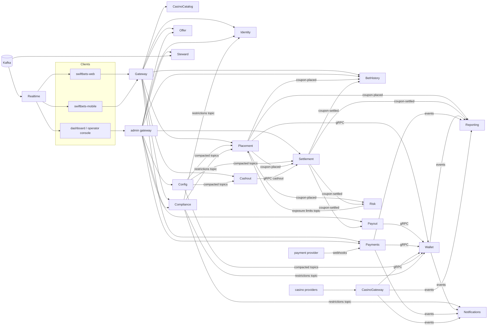

# SwiftBets - Product Plan

Status: **approved 1 Oct 2026** with the answers in `DECISIONS.md` D91, D97-D99. E1 in progress.

It extends `BLUEPRINT.md` (v1.2), `DEMO_SCOPE.md`, `PLAN.md` and `DECISIONS.md` (D1-D84). Where this plan changes an earlier decision, the change is listed in C1 and will be logged as D85 onwards, with ADRs under `docs/adr/`, once approved.

---

## The answer in ten lines

1. **What exists is a strong money-path core with a demo wrapper.** Placement, wallet, settlement and payout are real and well tested. Identity, the offer feed, the customer front end and every back-office surface are demo grade. Risk is an empty host.
2. **The biggest gaps are the ones that make it a product:** customer accounts, responsible gambling, deposits and withdrawals, a real feed, a customer website, and an operator console.
3. **Change the epic order.** The brief puts the customer web at E6 and the back office at E9, but its own vertical-slice rule needs a UI in every feature. So `swiftbets-web` starts in E1 and the operator console in E2. E6 and E9 become completion epics.
4. **Alerts and runbooks ship with each feature,** not in E10. E10 keeps drills, the load test and the status page.
5. **Make the bet-model change once and early.** Bankers and system bets need a coupon to hold several bets. That is the one breaking domain change, so it lands first in E4, before cashout and bet history build on top of it.
6. **Enforce responsible-gambling limits inside the wallet transaction** that moves the money, so two concurrent bets cannot both slip under a limit.
7. **Risk never blocks placement synchronously.** Exposure limits reach placement on a compacted topic, the same way config does.
8. **12 new repos would take the estate to 25.** Fewer is better, so: one casino repo with three hosts, the admin gateway inside `swiftbets-gateway`, and a bot that opens every shared-package bump PR.
9. **Some brief items are not available for free:** a public casino provider sandbox, a free real-time feed licensed for commercial use, three hosted environments. I propose honest substitutes for each (C1).
10. **Estimate: about 120-150 focused build days across 11 epics.** Five questions block work (section E). Each has a default, so I can start E1 the day this is approved.

---

## A. Inventory

### A1. What each repository does today

Test counts are xUnit `[Fact]`/`[Theory]` cases and Vitest/Jest/Playwright cases as of `main` on 1 Oct 2026. **No repository measures line or branch coverage.** No coverage tool is wired into `dotnet.yml`, so coverage is described by what the tests exercise.

| Repo | What it actually does | Tests | Stubbed or missing | Demo-only |
|---|---|---|---|---|
| **contracts** 0.4.2 | Event envelope, `TopicName`, error envelope, `Result`, `Money`. Events for offer, placement, settlement, payout and Steward. Wallet gRPC v1 proto. Generated JSON Schemas and TS types, snapshot-tested | 11 (round trip, null handling, schema/TS snapshots, topic naming) | No identity, account, payment, compliance, casino, config, cashout or audit contracts. The envelope carries no brand/market context (blueprint's "Identifier on every call" is not implemented). `Money` is single currency in practice | - |
| **building-blocks** 0.4.3 | Resilience pipelines; Kafka consumer host with DLQ, pause and retry-due; transactional outbox and claiming relay (SQL Server only); inbox; DbUp runner; least-privilege grant; Redis; observability; RFC 7807 envelope; JWT/JWKS; fault points; client-credentials token cache | 30 (broker compatibility, DLQ keeps partition flowing, outbox rollback atomicity, inbox dedupe, keyed retry, fault-point rules) | Migrations are forward-only: no rollback scripts or down-migration support. No Postgres outbox (`FOR UPDATE SKIP LOCKED`), so a Postgres service cannot publish through an outbox | `IFaultPoint` and `/faults` endpoints (refused in Production) |
| **offer** | Replays the embedded EPL 2024-25 season on a compressed clock into a Redis offer store (one hash per fixture, `offerVersion`). Publishes fixture-changed, price-changed and result-published. Read API; operator suspend/resume | 20 (replay determinism, versioned save, corrections, suspension, odds rules) | No feed-adapter port: the replay *is* the feed. Two markets only (1X2, O/U 2.5). No Postgres catalogue, no cache tiers, no sports/competitions model, no in-play state | The whole feed. Every 25th result is a synthetic correction (D62) |
| **placement** (4 hosts) | **Placement.Api:** coupon saga with durable intents, sweeper, outbox and relay; price-change policy; idempotent replay; `/me/coupons`; `/me/balance`. **Identity module:** password and client-credentials grants, RS256 + JWKS, rotating refresh with reuse detection. **Wallet.Api:** double-entry ledger, reserve/capture/release/credit/debit over gRPC, blacklist, operator top-up. **History** projector in Postgres | 40 (kill-mid-saga, concurrent duplicate, wallet outage, refresh reuse, concurrent reserve dedupe, blacklist, projection convergence) | Singles and accas only. Risk limits are a hard-coded `RiskLimits.Default`. ZAR only, hard-coded in the validator and `/me/balance`. No placement modes or kill switch. No session refresh, live delay, free bets, registration, password reset or account status. The wallet sum(entries) = balance reconciler (D7) **is not implemented** | `DemoUserSeeder` (punter1-5, operator1, admin1, load users). Wallet migration `0003_demo_accounts` funds punters with R1 000. Top-up is the only way to fund an account (D48) |
| **settlement** | Indexer, priority-gated evaluator, token-guarded Lua counters, two-stage evaluate → Kafka → settle, reconciler with repair, inbound DLQ, operator refresh and state | 19 (any-order settle and resettle, duplicate no-op, reconciler repair, rules) | No manual results (coupon/market/override/time-void). No final-state lock for cashout. No archive job. Settles one bet per coupon. No explicit test of the partition-ordering assumption | Fault points `settlement.settler.drop` and `settlement.evaluator.after-commit` |
| **payout** | Delta payouts with versioned keys, per-coupon lease, named-step ladder on topics (5s/1m/15m), dead-letter and replay, blacklist parking | 17 (outage drains with zero double pay, crash after credit, clawback, ladder rungs) | No tax line. No bet-activity record. No risk settle-inform (no external risk yet) | Fault point `payout.after-credit` |
| **steward** | Four deterministic detectors; tool-calling agent behind a model port (anthropic, replay, disabled, recorder); evidence validator; hybrid pgvector + full-text runbook search; approval-gated remediation with audit; drills; spend ledger | 29 (evidence validation, RRF, incident folding, approval state machine, budget stop) | Four incident kinds and three actions only. No Prometheus alert input. No ledger, provider or customer-impact tools. Retrieval eval is a script, not a CI gate | Drills; the replay model provider is the local default (D74); `WalletOutageProbe` |
| **gateway** | YARP edge. Browser session cookies (access and refresh JWTs in httpOnly cookies on `/api`), CSRF header, header stripping, Redis rate limits | 17 (cookie/CSRF matrix, spoofed identity, rate limit) | Sessions are self-contained JWTs, so a device session cannot be listed or revoked. No admin/back-office route policy. No permission model | `/api/session/demo` and `/demo/token` auto-sign visitors in. Off unless configured, but on in the preview |
| **realtime** | Kafka → SignalR bridge. Groups `ops`, `punter:{sub}`, `fixture:{id}`; Redis sequence per group; Redis backplane; cookie auth via gateway (no token handed to JavaScript) | 11 (group isolation, sequence, auth) | No feed-health signal for clients. No casino, wallet or risk groups | - |
| **risk** | Hello-world host: health, metrics, Kafka registration | 7 (host and architecture rules only) | **Everything.** No actors, no Akka.NET reference | - |
| **dashboard** | React 19 ops UI under `/ops`: live feed, anomalies, incidents with approve/reject, fault panel, sign-in. TanStack Query, Jotai, Tailwind v4 tokens, nonce CSP, single 401 hook | 14 (Vitest units plus 2 Playwright specs: recovery, axe) | No trader, customer-service or finance views. No role-based screens | Fault panel. "Takes the demo operator seat when the session belongs to a punter" |
| **mobile** | Expo app: fixtures, live odds, betslip (singles/accas, price-change prompt), place bet, my bets, live balance. SecureStore tokens, single-flight refresh. Signed APK from tags. **Its web export is also the public betting site** (`web` service in compose) | 5 (betslip state, API client) | Betslip is not persisted. No registration, wallet, cashout, casino, limits or account screens. Web CSP allows `'unsafe-inline'` styles | Demo sign-in on native. Cloudflare analytics beacon in the CSP |
| **platform** | Compose stack; topic catalogue (34 entries); SQL Server/Postgres init; library + per-service + infra + umbrella charts; kind install in CI; Terraform for one OCI ARM VM with k3s plus Azure SQL free offer; reusable CI (build, test, CodeQL, Trivy, multi-arch GHCR); three Grafana dashboards; live eval script | n/a (CI runs `helm lint`, kubeconform, kind install) | One cloud environment. No staging/prod split, no secret store (Terraform writes a Kubernetes Secret), no backups or restore drills, no Alertmanager or alert rules, no status page, no retention jobs | `make reset`; demo passwords in `.env`; `eval/__pycache__/*.pyc` is committed |

### A2. Platform-wide facts that shape the plan

- **Stores:** SQL Server for the four money databases (`SbPlacement`, `SbWallet`, `SbSettlement`, `SbPayout`). Postgres for `sb_history` and `sb_steward`. Redis for offer, counters, rate limits and the backplane.
- **Cloud:** Azure SQL free offer from one OCI Always Free ARM node (4 OCPU, 24 GB). Everything else runs on that node.
- **Packages:** shared NuGet and npm packages ship as GitHub Release assets (D34). Every contracts or building-blocks release means a pinned bump PR in every consuming repo. Today that is up to 10 repos, all by hand.
- **Measured:** 150 placements/s sustained on one node, p99 117 ms (D50). The full-chart kind install reached p99 327 ms (D82).
- **Fixed by design and present in code:** durable saga intents; named ladder steps; the settlement reconciler; inbound DLQ; one resilience library; the multi-instance claiming relay.
- **Fixed by design but not yet in code:** cashout quote max-age (no cashout); bet-history integrity check against the transactional store (no integrity job); an idempotency key on every activity record (there is no activity stream); explicit rejection of a manual result on a cashed-out bet (no manual results).

### A3. Demo-only register (what has to change before real customers)

| Item | Where | Product treatment |
|---|---|---|
| Seeded users and passwords | placement `DemoUserSeeder`, compose `.env` | Move to a `seed` job that runs only in dev and preview; never in staging or prod |
| Seeded wallet balances in a numbered migration | wallet `0003_demo_accounts.sql` | Cannot be deleted from history. A new migration removes seed rows only where the deployment is flagged `demo`; the seed moves to the dev seed job |
| Operator top-up as the only funding | wallet `TopUpEndpoint` | Kept as an audited, permission-gated manual adjustment; deposits come from payments |
| Demo sign-in | gateway `/api/session/demo`, mobile, dashboard demo seat | Kept only behind the `preview` profile; removed from staging and prod values, with a test asserting it is off |
| Replay feed | offer | Kept as the dev and demo adapter behind the new feed port |
| Synthetic result corrections | offer `CorrectionEvery` | Replay adapter only |
| Fault points and drills | building-blocks, every service, Steward | Kept; already refused in Production. Staging allows drills for restore and alert tests |
| Hard-coded limits and currency | placement `RiskLimits.Default`, ZAR validator | Replaced by config and compliance |
| Replay model provider as default | Steward | Dev and CI default only; staging uses the live model under the spend cap |
| Load-test users | placement seeder | Dev and CI seed job only |
| Mobile web export as the website | compose `web` | Replaced by `swiftbets-web` |
| Committed `.pyc` | platform `eval/` | Delete and git-ignore |

---

## B. Gap analysis

Classification: **build new**, **extend** (add to what works), **refactor** (same behaviour, new shape), **replace** (throw away and rebuild), **keep** (no change beyond package bumps).

### B1. Existing repositories

| Repo | Capability | Brief | Class | Notes |
|---|---|---|---|---|
| contracts | Envelope, errors, result, topic naming | 2 | keep | Add a brand/market context to the envelope in 1.0.0 (D2 below) |
| | Coupon/bet events | 3.4 | extend | `CouponPlacedV2`/`CouponSettledV2` with `bets[]` for bankers and system bets |
| | Identity, compliance, payments, casino, config, cashout, audit, notification events | 3.1-3.11 | build new | One contracts PR per epic, versioned |
| | Wallet gRPC | 3.3 | extend | `swiftbets.wallet.v2` proto: accounts per (user, currency), bonus buckets, deposit headroom, statement |
| building-blocks | Migration runner | 1 | extend | Rollback scripts, `--to <version>`, up-down-up test helper |
| | Outbox | 2 | extend | Postgres variant for Postgres-backed publishers |
| | Compacted-topic state consumer | 3.4 | build new | Hydrate to partition EOF, readiness gated until hydrated (config, risk limits, restrictions) |
| | Webhook verification | 3.3, 3.5 | build new | HMAC signature, timestamp window, replay cache |
| | Audit writer | 3.2 | build new | `IAuditTrail.RecordAsync` through the outbox, in the caller's transaction |
| offer | Replay feed | 3.4 | refactor | Becomes one adapter behind `IFeedAdapter` |
| | Real feed adapter | 3.4 | build new | One provider adapter with anti-corruption mapping and polling budget (Q2) |
| | Catalogue (sports, competitions, fixtures) | 3.4 | build new | Postgres catalogue; Redis stays the live truth |
| | Read API cache tiers | Blueprint 4 | extend | In-process hybrid cache + stale-while-revalidate + fail-safe |
| | Markets | 3.4 | extend | Add BTTS, Double Chance, correct score (pre-match) |
| | In-play seams | 3.4 | extend | Market state machine (open/suspended/closed), live flag, per-market bet delay key |
| placement | Saga, outbox, sweeper | - | keep | |
| | Identity module | 3.1 | replace | Moves to `swiftbets-identity`, then is deleted here |
| | Wallet hosts | 3.3 | refactor | Repo move to `swiftbets-wallet`; code unchanged at first |
| | History projector | 3.4 | refactor | Moves to `swiftbets-bethistory` |
| | Bet model | 3.4 | refactor | Coupon → bets → legs; bankers; system bets (k-from-n) |
| | Risk limits | 3.4, 3.9 | replace | Limits from config; exposure caps from risk via compacted topic |
| | Placement modes and kill switch | Blueprint 2 | build new | `Normal | Blocked | Delegated`, per brand and market, from config |
| | Session refresh and live delay | 3.4 | build new | Named refresh operation; delay from config (seam only, pre-match in v1) |
| | Delegated/agency mode | 3.4 | build new | Cashier places for a customer; parent account resolved from identity projection |
| | Free bets | 3.3 | build new | Second `IFundsSource` over the wallet's bonus bucket |
| settlement | Core pipeline | - | keep | |
| | Bet-level settlement | 3.4 | refactor | Settle per bet; banker-lost shortcut; system bets as N bets |
| | Manual results | 3.4 | build new | Coupon, market, override and time-void, with `IsManual` and priority |
| | Cashout final-state lock | 3.4 | build new | gRPC `Cashout` → final flag in Redis and SQL → evaluated re-entry |
| | Archive job | Blueprint 6 | build new | Moves closed history out of hot tables |
| | Ordering test | Blueprint 4 | extend | Explicit test that one coupon's evaluations stay on one partition |
| payout | Ladder, delta, blacklist | - | keep | |
| | Bet-activity record | Blueprint 5 | build new | `wallet.activity` with the idempotency key on every record |
| | Tax line | Blueprint 7 | extend | Config-driven second posting (zero rate by default) |
| steward | Agent, RAG, approvals | 3.13 | extend | Alertmanager webhook input; full rule set; new tools; CI retrieval and transcript gates |
| gateway | Browser sessions | 3.1 | refactor | Opaque server-side sessions in Redis, so device sessions can be listed and revoked |
| | Admin gateway | 3.4 | build new | Second host in this repo, separate deployment and hostname, permission policies |
| realtime | Bridge | 3.6 | extend | Feed-health signal; groups for wallet, cashout offers and risk |
| risk | Everything | 3.9 | build new | Akka.NET actors, sharding, persistence, detectors, exposure limits, SignalR push |
| dashboard | Ops UI | 3.8 | extend | Becomes the operator console: trader, customer service, finance, Steward, config, RBAC |
| mobile | Betting app | 3.7 | extend | Parity on money flows; persisted slip; biometric unlock |
| | Web export as public site | 3.6 | replace | Retired once `swiftbets-web` serves the site |
| platform | Compose, charts, CI | 3.12 | extend | New services; env values; secret store; backups; alert rules |
| | Terraform | 3.12 | extend | Per-environment roots over shared modules; Object Storage for backups; vault |

### B2. New repositories and services

| New repo | Hosts | Store | Brief | Why it is its own repo |
|---|---|---|---|---|
| `swiftbets-identity` | Identity.Api, Migrator | SQL Server `SbIdentity` | 3.1 | Issues every token; different change rate and blast radius from placement |
| `swiftbets-wallet` | Wallet.Api, Reconciler worker, Migrator | SQL Server `SbWallet` | 3.3 | Already a separate process; owns balances; called by placement, payout, payments, casino |
| `swiftbets-compliance` | Compliance.Api, Migrator | SQL Server `SbCompliance` | 3.2 | Limits, exclusions, KYC and the audit store: one regulated owner |
| `swiftbets-payments` | Payments.Api (incl. webhooks), Reconciler worker, Migrator | SQL Server `SbPayments` | 3.3 | Provider integrations and money in/out |
| `swiftbets-config` | Config.Api, Migrator | Postgres `sb_config` + compacted topics | 3.4 | Source of truth for runtime config and kill switches |
| `swiftbets-bethistory` | BetHistory.Api, projector worker, integrity job, Migrator | Postgres `sb_history` | 3.4 | CQRS read side with three audiences |
| `swiftbets-cashout` | Cashout.Api | none (stateless) | 3.4 | Quote and execute; no state of its own |
| `swiftbets-casino` | CasinoGateway.Api, CasinoCatalog.Api, SimulatedProvider, Migrators | SQL Server `SbCasino` (rounds, transactions); Postgres `sb_catalog` | 3.5 | One integration surface, released together (see C1.4) |
| `swiftbets-web` | Web (SSR) | none | 3.6 | Customer site |
| `swiftbets-design-tokens` | npm package | n/a | 3.6 | Brand tokens shared by web, console and mobile |
| `swiftbets-reporting` | Reporting worker + export API, Migrator | Postgres `sb_warehouse` | 3.10 | Warehouse load must not touch transactional stores |
| `swiftbets-notifications` | Notifications worker + API, Migrator | Postgres `sb_notifications` | 3.11 | Templates, preferences, provider abstraction |

Admin gateway and status page are deliberately **not** new repos: the admin gateway is a host in `swiftbets-gateway`, and the status page lives in `swiftbets-platform/status` (C1.4, C1.15).

### B3. Target service map

---

## C. Feedback

### C1. Where I disagree with the brief, and what I would do instead

Each item becomes a row in the `DECISIONS.md` conflicts table on approval.

1. **Epic order: UI with every slice, not at the end.** The brief's slice rule says a feature is done only when it works end to end through the UI. Yet E6 (web) and E9 (back office) come after E2-E5, which all need a customer screen or an operator screen. So:
   - `swiftbets-web` is scaffolded in E1 with registration, login and account;
   - the operator console gains its customer-service view in E2;
   - E6 and E9 become completion epics: multi-brand, performance and SEO for web; trader polish, reporting and notifications for the back office.
2. **Alerting and runbooks ship with the feature that needs them.** If they wait for E10, payments and casino go live with no alert on webhook failures or reconciliation drift. Each feature's PR set includes its Prometheus rule and runbook (which also feeds Steward). E10 keeps the cross-cutting work: Alertmanager routing, restore drills, the status page, the load test.
3. **Risk feeds placement asynchronously, never by a synchronous call.** The brief says exposure limits "feed placement's risk module". A synchronous call would make a risk outage a placement outage.
   - Risk publishes per-fixture and per-outcome exposure caps to a compacted topic. Placement holds them in memory, hydrated to partition end before it reports ready.
   - The placement risk module stays the hard gate (D27 kept for that part). Risk is no longer advisory only: its caps are enforced, but locally.
4. **Fewer repos, and automated bump PRs.** The brief's split would take the estate to about 26 repos. Each contracts release already means a hand-made bump PR per consumer. My proposal:
   - **casino** is one repo with gateway, catalog and simulated-provider hosts. They share the provider model and always release together.
   - **the admin gateway** is a second host in `swiftbets-gateway`. It shares the YARP and session code, but has its own deployment, hostname and policies.
   - **a platform workflow** opens the pinned-bump PR in every consuming repo when contracts or building-blocks tag a release, and links them in one tracking issue.
5. **Per-service store choice, and the Azure SQL free-offer cap.** The free offer limits how many databases one subscription gets (verify the current number before E1). The money writers need SQL Server's `UPDLOCK`/`READPAST` patterns, which the outbox and saga already depend on.
   - **Rule:** SQL Server for services that move money or own regulated state (identity, wallet, compliance, payments, casino rounds). Postgres for read models and non-money stores (catalogue, bet history, config, reporting, notifications, Steward).
   - This needs the Postgres outbox variant in building-blocks.
   - Recorded as an ADR in E1.
6. **Three environments do not fit the free tier.** One Always Free node cannot host dev, staging and prod of a ~25-service stack. Proposal (Q3):
   - **dev:** compose plus an ephemeral kind cluster in CI on every PR (already in place);
   - **staging:** the existing OCI node;
   - **prod:** fully defined in Helm values and Terraform. CI runs `plan` and `kubeconform` on it, and it is applied only when a paid target exists.

   I would also use a directory per environment over shared modules, not Terraform CLI workspaces. Workspaces share one backend and one credential set, which is the wrong default when prod should not be reachable from staging credentials.
7. **There is no public casino provider sandbox we can rely on.** Providers and aggregators issue sandbox credentials only under a commercial agreement. Instead, build **two simulated providers with different wallet models**:
   - a seamless-wallet provider (bet/win/rollback callbacks);
   - a transfer-wallet provider (debit in, credit out per session).

   Together they prove the adapter port handles both integration styles. A real aggregator adapter becomes a documented next step, not a v1 promise.
8. **A real feed has licensing and rate limits.** Free tiers of fixture and odds APIs restrict commercial use and cap requests per day. The real adapter will:
   - be polling-budget aware, with every response recorded so it can be replayed in tests;
   - run behind a flag in staging only.

   CI never calls the provider: contract tests run against recorded responses. Replay stays the dev default (Q2).
9. **Migration rollback: a convention, and an honest exception.** DbUp is forward-only. Proposal:
   - every new script `NNNN_name.sql` ships with `NNNN_name.rollback.sql`;
   - the migrator gains `--to <version>`;
   - CI runs up → down → up on every migrator.

   Existing initial-schema migrations (`0001`/`0002` in each service) are declared non-rollbackable: their rollback is "drop the database", and no product data exists yet. The `0003_demo_accounts` seed is handled as in A3.
10. **Back office needs permissions, not just roles.** The brief lists roles (customer, agent, trader, ops, admin). Operator screens need finer control: "settle manually" and "change a customer's limits" should not come together just because both belong to "ops".
    - Identity maps roles to permissions and puts a `perm` claim in staff tokens only.
    - The admin gateway authorises each route by permission policy.
    - Customer tokens stay small. Current `Punter`/`Operator`/`Admin` claims are accepted alongside the new ones for one release, then removed.
11. **Device sessions need opaque server-side sessions at the gateway.** Today the browser cookie holds the JWTs themselves, which cannot be listed or revoked before expiry. In the new design:
    - the cookie carries a random session id;
    - the session (tokens, device, last seen) lives in Redis and rotates on refresh;
    - revocation, self-exclusion and suspension delete it at once.

    The realtime hub keeps cookie auth through the gateway, so no route ever hands a bearer token to JavaScript.
12. **"Complete and operable" is not "licensed for real money".** The product will run end to end on sandbox payment providers with real compliance controls. Real money also needs a gambling licence, PSP onboarding, AML/FICA processes, and POPIA data-protection sign-off.
    - Hosted payment pages keep card data out of scope (no PCI cardholder environment).
    - Legal sign-off is out of scope for engineering, and the README will say so.
13. **Enforce responsible-gambling limits in the wallet transaction.** If placement or payments checked limits by calling compliance, two concurrent requests could both pass. Instead:
    - compliance owns limit values and publishes them on a compacted restrictions topic;
    - the wallet keeps per-account period counters (deposits, stakes, net loss) and refuses a reserve or deposit credit *under the same account lock* that moves the money;
    - self-exclusion and suspension are enforced at three points: the wallet (all debits), identity (login) and the gateway (session revoke).
14. **Bankers and system bets change the core model, so they go first in E4.** A system bet is several bets on one coupon. Today's contract has one bet per coupon, although the payout key already reserves `bet1` (D58).
    - Changes: contracts (new V2 types and topics), placement, settlement (per-bet), payout (per-bet keys) and history.
    - Done once, before cashout, bet history and risk are built on the V1 shape, with a dual-publish window and a migration note.
15. **The status page must not share the platform's fate.** Instead of hosting it on the same node, use a static page on GitHub Pages, built by a scheduled Action that probes the public endpoints and records history in the repo. It stays up when the cluster is down.
16. **The customer web renders on the server: React Router 7 framework mode.** The brief leaves SSR versus static-with-islands open.
    - **Why SSR:** public catalogue pages (home, sport, fixture) need to be indexable and fast on first paint. Account and betslip areas are client-interactive.
    - **How:** React Router 7 SSR on Node (the router the dashboard already uses, D21). Loaders fetch through the gateway with the session. TanStack Query is seeded from the loader (one cache, not two). The Node server mints the CSP nonce per request instead of nginx `sub_filter`.
    - **Brands:** build-time theming from the tokens package.
    - **Budgets:** modern browsers only, with a bundle budget as a CI gate.
    - Recorded as an ADR in E1.
17. **The outbox relay stays in-process.** The blueprint's separate relay service is superseded by D51 (the per-service claiming relay in building-blocks). It is already multi-instance safe, and a separate service would add a hop and a deployable for no gain.
18. **Mobile release channel.** App stores restrict real-money gambling apps to licensed operators in approved countries. v1 ships the signed APK through GitHub Releases, as today. Casino launch on mobile opens in an in-app browser, not a native integration.

### C2. Gaps a senior reviewer would expect (not in the brief)

- **Brand and market context on every message.** The blueprint promises it, but the code does not carry it. Without it, multi-brand, per-market limits and per-market config cannot work. Contracts 1.0.0 adds a required `context` (brand, country, channel) to the envelope and request headers.
- **Limit-change rules.** A decrease takes effect at once. An increase waits a cooling period (24 h default) and needs re-confirmation. Self-exclusion cannot be lifted early.
- **Four-eyes on dangerous operator actions:** manual resettlement above a threshold, manual balance adjustment, lifting a restriction. One operator requests, another approves, both are audited. This reuses Steward's approval state machine.
- **Tamper-evident audit.** Audit rows are hash-chained per stream, and a verify job reports a broken chain.
- **Marketing suppression.** Notifications must check restrictions: a self-excluded customer receives only service messages.
- **Customer statement.** A wallet statement API (deposits, stakes, returns, withdrawals) for customers and customer service.
- **PII handling.** KYC documents go to object storage encrypted with a per-tenant key. Analytics in the warehouse are pseudonymised. A retention policy balances erasure requests against the AML retention period (5 years by default).
- **Webhook and callback hardening.** HMAC signature, timestamp window, replay cache, an IP allowlist for provider callbacks, and a 2xx only after the durable write.
- **Credential abuse.** Rate limits on registration, login and reset per IP and per account; lockout with backoff; breached-password check (k-anonymity range query, optional).
- **Signing-key rotation.** JWKS serves two keys by `kid` during an overlap window. Rotation is a runbook and a test.
- **Coverage measurement.** Coverlet in `dotnet.yml`, with a branch-coverage floor on Domain and Application projects of money-path services. Coverage is reported on every PR.
- **Contract tests across producer and consumer.** Schema snapshots exist. Add a consumer test per topic that reads the producer's checked-in schema, so a release-order mistake fails CI instead of production.
- **Feature flags.** Separate from kill switches: per-brand rollout of new flows through config, with exposure logged.
- **Localisation and money formatting.** en-ZA first, with formatting through one helper on web and mobile.
- **Betslip robustness.** Persisted, read through a hydration-safe hook, merged per selection across tabs (not last-write-wins on the whole slip), and refreshed against live prices on load.
- **Feed health in the UI.** Every price-displaying screen shows a stale-price state when the realtime sequence gaps or disconnects, and refetches on reconnect.

### C3. Risks in build order

| # | Epic | Risk | De-risk |
|---|---|---|---|
| 1 | E1 | Identity extraction logs everyone out, or services reject the new issuer | Same signing key (D81) and the same `iss` value. Users copied by a one-shot data job; placement's identity module stays read-only behind a flag for one release; gateway route flip is a config change |
| 2 | E1 | Repo split loses history or breaks images | `git filter-repo` preserving history; image names unchanged; the chart already names `wallet` separately |
| 3 | E1 | Bump fan-out across about 20 repos stalls every contracts change | Automated bump workflow ships before the first new contract |
| 4 | E1-E3 | Azure SQL free-offer database cap is exceeded | Store rule in C1.5; count databases in the ADR; fall back to schemas in a shared database with separate logins if needed |
| 5 | E2 | Limit enforcement races (two bets both pass a stake limit) | Enforced under the wallet account lock; concurrency test with 20 parallel reserves against a limit |
| 6 | E3 | Webhook arrives before, twice, or never | Deposit intent stored first; webhook idempotent on provider event id; reconciler polls the provider for intents stuck pending; drift alert |
| 7 | E4 | Bet model V2 breaks in-flight coupons | Dual publish V1+V2 from placement; consumers move one at a time; V1 removed only when lag is zero and no V1 coupon is open |
| 8 | E4 | Cashout and a late result race | Final-state flag checked by the Lua script and in SQL under the coupon lock; a test fires a result and a cashout concurrently |
| 9 | E4 | Real feed rate limits or outages | Polling budget; fail-safe cached offer; staleness alert suspends markets automatically after a threshold |
| 10 | E5 | Provider callback ambiguity (timeouts, rollback of an unseen bet) | Store-and-accept rollback for unseen transactions; idempotent on provider transaction id; per-provider daily reconciliation |
| 11 | E6 | SSR plus CSP nonce plus TanStack hydration complexity | Spike in E1 (login page) proves the pattern before catalogue pages depend on it |
| 12 | E8 | Akka.NET persistence on Postgres under ARM | Spike in E8 week one with Testcontainers on arm64 runners; snapshot frequency tuned by test |
| 13 | E10 | Load target unmet once 12 more services share one node | Load test per epic gate on kind with the full chart; resource requests set from measurements |
| 14 | All | One VM is a single point of failure for staging | Backups to Object Storage from E1; restore drill per database in E10; documented RPO and RTO |

### C4. What I would cut from v1 without making it unusable

**Cut or defer (the product still works for a customer and an operator):**
- Delegated/agency placement: model the parent link and mode now, ship the flow in v1.1.
- In-play betting itself (seams only, as the blueprint says).
- Correct-score and other exotic markets beyond 1X2, O/U, BTTS and Double Chance.
- Second real casino adapter (two simulated providers only).
- Push notifications on mobile (email and in-app only).
- Biometric unlock.
- Real withdrawal rails (withdrawals run on the simulator; deposits on the real test-mode adapter).
- Bonus engine beyond free bets and free spins (no wagering-requirement engine).
- Syndicate detection beyond two rules (repeated identical bets; correlated stake clustering).
- Grafana business dashboards beyond GGR, turnover, active users and provider performance.

**Must not be cut:** registration with age gate, login, reset and sessions; every responsible-gambling control and its enforcement; KYC gating of withdrawals; the audit trail; deposits with webhook reconciliation; ledger reconciliation; the four money-path failure tests on every new money path; manual results; kill switches; backups with a tested restore.

---

## D. Plan

### D1. Contracts roadmap

Semver applies to the **package**. A new event type on a new topic is additive (minor). Changing or removing an existing type is a major.

| Version | Epic | Contents | Kind |
|---|---|---|---|
| 0.5.0 | E1 | Identity events (`UserRegisteredV1`, `EmailVerifiedV1`, `AccountStatusChangedV1`, `SessionRevokedV1`); `AuditRecordedV1`; `NotificationRequestedV1` | minor |
| 0.6.0 | E2 | `LimitChangedV1`, `RestrictionsChangedV1` (compacted), `SelfExclusionStartedV1`, `KycStatusChangedV1` | minor |
| 0.7.0 | E3 | Payment events (`DepositInitiatedV1`, `DepositConfirmedV1`, `WithdrawalRequestedV1`, `WithdrawalCompletedV1`); `swiftbets.wallet.v2` proto (accounts per user and currency, bonus bucket, deposit headroom, statement); `WalletActivityV1` with idempotency key | minor |
| **1.0.0** | E4 | Envelope gains a required `context` (brand, country, channel). `CouponPlacedV2`/`CouponSettledV2` (bets[], bankers, system), config topics, manual result events, cashout gRPC proto. V1 coupon types stay | **major** (envelope) |
| **2.0.0** | E4 gate | Remove `CouponPlacedV1`, `CouponSettledV1` and `swiftbets.wallet.v1` once no consumer or open coupon uses them | **major** |
| 2.1.0 | E5 | Casino round and transaction events; provider reconciliation events | minor |
| 2.2.0 | E8 | `ExposureLimitsChangedV1` (compacted), `LiabilityChangedV1`, `RiskAlertV1` | minor |
| 2.3.0 | E9 | Warehouse export and notification-delivery events | minor |

Every major ships a migration note in the contracts release, listing consumers, the dual-run window and the removal criteria.

### D2. Epics in dependency order

Effort is focused build days. Every gate includes:
- all PRs merged with green CI;
- the epic's money-path integration tests (duplicate, out-of-order, crash-reprocess, dependency outage) passing;
- the features usable end to end in the dev environment;
- `ARCHITECTURE.md`, ADRs and runbooks updated.

#### E1 Foundations, identity and the customer front door (16-20 d)

- **Features, one at a time:**
  1. **Shared tooling:** migration rollback convention; Postgres outbox; compacted-state consumer; audit writer; coverage gate; automated bump workflow.
  2. **Wallet extraction:** repo move; daily ledger reconciliation (sum of entries vs balance per account and bucket), with a drift metric, alert and runbook.
  3. **Identity extraction:** token issuance, JWKS and refresh moved, users copied, gateway routed.
  4. **Registration with age gate (18+) and email verification.** `swiftbets-notifications` starts here with email only, through a provider port; Mailpit in dev and CI.
  5. **Password reset,** plus opaque gateway sessions with a device list and revocation.
  6. **Roles, permissions and account status** (active, suspended, closed, self-excluded); a parent/cashier link modelled but not used.
  7. **`swiftbets-web` skeleton and `swiftbets-design-tokens`:** register, verify, login, reset, account, sessions, under Playwright and axe.
  8. **Environments, secrets and backups:** per-env Terraform roots and values; External Secrets with a vault (Q3); nightly logical backups to Object Storage for every database.
- **Repos:** building-blocks, platform, wallet (new), placement, identity (new), gateway, notifications (new), web (new), design-tokens (new), contracts, dashboard.
- **Contracts:** 0.5.0. Building-blocks 0.5.0 (rollback, Postgres outbox, state consumer, audit, webhooks later).
- **Migrations:** `SbIdentity` 0001-0003 (users and credentials, verification and reset tokens, sessions and roles/permissions) with rollbacks; `SbWallet` 0004 reconciliation runs, plus 0005 removal of demo seed outside demo deployments; `sb_notifications` 0001; placement 0003 drops the `auth` schema after cut-over (rollback recreates it empty; data restored from the identity copy, documented).
- **Gate:**
  - a new visitor registers on `swiftbets-web`, verifies email (Mailpit), logs in, sees and revokes a second device's session;
  - all existing flows work against the new identity service with no forced logout;
  - a restore of `SbWallet` from last night's backup to a scratch instance succeeds in CI.

#### E2 Responsible gambling and compliance (10-13 d)

- **Features:**
  1. Audit trail service and console view.
  2. Deposit, stake and loss limits (day/week/month), with cooling on increases, enforced in the wallet.
  3. Session time limits and reality checks (gateway session clock, web prompt).
  4. Cooling-off and self-exclusion, enforced at login, wallet and gateway, with marketing suppression.
  5. KYC abstraction with a sandbox verification adapter; status gates withdrawals.
  6. Operator console customer-service view: account, limits, notes, audit, restrictions with four-eyes lift.
- **Repos:** compliance (new), wallet, identity, gateway, placement (error mapping), notifications, web, dashboard, contracts, platform.
- **Contracts:** 0.6.0.
- **Migrations:** `SbCompliance` 0001-0004 (limits, restrictions, KYC cases, audit with hash chain); `SbWallet` 0006 period counters; `SbIdentity` 0004 restriction projection.
- **Gate:**
  - 20 concurrent reserves against a stake limit admit exactly the allowed amount;
  - a self-excluded customer cannot log in, bet, deposit or receive marketing;
  - every limit change and operator action appears in the audit view, and the chain verifies.

#### E3 Payments and multi-currency wallet (11-14 d)

- **Features:**
  1. Wallet v2: accounts per (user, currency), bonus bucket, statement API.
  2. Payments service with provider port; simulator adapter (deposits and withdrawals); real test-mode adapter for deposits (Q1).
  3. Signed webhooks with idempotent processing, and a reconciler for stuck intents.
  4. Withdrawals gated by KYC and restrictions, with operator approval above a threshold.
  5. Daily provider-vs-ledger reconciliation with a drift alert.
  6. Web wallet pages (deposit, withdraw, statement); console finance view (payout queue, reconciliation, dead letters).
- **Repos:** payments (new), wallet, placement, payout, building-blocks (webhook verification), web, dashboard, contracts, platform.
- **Contracts:** 0.7.0.
- **Migrations:** `SbPayments` 0001-0003; `SbWallet` 0007-0008 (currency-scoped accounts, bonus bucket), with a data migration mapping existing accounts to (user, ZAR).
- **Gate:**
  - deposit through the test-mode provider credits exactly once with the webhook delivered twice and out of order;
  - a withdrawal for an unverified customer is refused;
  - the reconciler flags an injected provider/ledger mismatch and Steward opens an incident.

#### E4 Sportsbook completion (24-30 d)

- **Features:**
  1. **Bet model V2:** bankers and system bets through placement, settlement, payout and history; contracts 1.0.0 with dual publish.
  2. **Bet-history extraction** with customer, admin and back-office APIs, open-bet lookups and an integrity job against the transactional stores.
  3. **Config service:** compacted topics, partition-EOF hydration, kill switches, placement modes, live-delay key, limits and feature flags; placement and settlement consume it.
  4. **Admin gateway:** manual results (coupon, market, override, time-void), bet refresh, market suspension, limits administration; explicit rejection of a manual result on a cashed-out bet.
  5. **Cashout:** quote with HMAC and max-age, execute with recompute and leeway, settlement final-state lock, realtime offer updates.
  6. **Feed adapter port,** one real provider (Q2), Postgres catalogue, cache tiers, extra markets, staleness auto-suspend.
  7. **In-play seams:** market state machine, session refresh operation, bet delay applied from config.
  8. **Web sportsbook:** home, sport listing, fixture view, persisted betslip, my bets, cashout. Contracts 2.0.0 removes V1 at the gate.
  9. **Agency mode:** cut candidate (C4); modelled only unless time allows.
- **Repos:** contracts, placement, settlement, payout, bethistory (new), config (new), cashout (new), gateway (admin host), offer, realtime, web, dashboard, platform.
- **Migrations:** `SbPlacement` 0004-0005 (bets table, banker flags, mode); `SbSettlement` 0003-0005 (bet-level settlements, manual results, final state, archive); `SbPayout` 0003 (per-bet keys); `sb_history` 0002-0003 (bets and lookups, integrity runs); `sb_config` 0001; `sb_catalog` 0001 in offer.
- **Gate:**
  - a Trixie with a banker settles correctly from out-of-order results and resettles on a correction;
  - a cashout during a late result pays exactly once;
  - the kill switch stops placement within 5 seconds;
  - a trader voids a market from the console and sees an explicit rejection for a cashed-out bet;
  - the real-feed adapter passes contract tests on recorded responses.

#### E5 Casino (12-15 d)

- **Features:**
  1. Catalog: games, providers, categories, per-brand and per-market availability; lobby API.
  2. Gateway launch: signed launch sessions, provider adapter port.
  3. Seamless-wallet simulated provider: bet/win/rollback, idempotent on provider transaction id, store-and-accept rollback.
  4. Transfer-wallet simulated provider.
  5. Per-provider daily reconciliation with a drift alert.
  6. Free spins v1, with the bonus engine schema reserved.
  7. Web lobby and launch.
- **Repos:** casino (new), wallet, compliance (restrictions apply to casino), web, dashboard, contracts, platform.
- **Contracts:** 2.1.0.
- **Migrations:** `SbCasino` 0001-0003; `sb_catalog` 0001-0002.
- **Gate:**
  - a duplicate win callback credits once;
  - a rollback for an unseen bet is stored and accepted;
  - reconciliation flags an injected mismatch;
  - a self-excluded customer cannot launch a game.

#### E6 Customer web completion (7-9 d)

- **Features:** multi-brand build from tokens (two brands, Q5 default); promotions page; SEO metadata and sitemap; performance budgets (LCP, JS bundle) and WCAG 2.2 AA (axe with zero violations) as CI gates; Playwright across every money flow on both brands.
- **Repos:** web, design-tokens, platform.
- **Contracts and migrations:** none.
- **Gate:** both brands build and deploy; Lighthouse and axe budgets pass in CI; every money flow passes Playwright.

#### E7 Mobile parity (6-8 d)

- **Features:** registration and login through identity; wallet (deposit via hosted page in an in-app browser, withdraw, statement); limits and self-exclusion; persisted betslip with bankers and system bets; cashout; casino lobby and in-app-browser launch; tokens from the tokens package; biometric unlock (optional, cut candidate); retire the web export.
- **Repos:** mobile, platform.
- **Gate:** the signed release APK runs every money flow against staging; Jest and a Maestro smoke flow pass in CI.

#### E8 Risk and trader views (9-11 d)

- **Features:**
  1. Fixture liability actors with sharding (one node, sharding-ready) and event-sourced snapshots in Postgres.
  2. Exposure limits published to placement via a compacted topic.
  3. Repeated-bet and correlated-stake detectors.
  4. SignalR push to the console trader view (liability per fixture, live bet feed, alerts).
- **Repos:** risk, placement (consume limits), realtime, dashboard, contracts, platform.
- **Contracts:** 2.2.0.
- **Migrations:** `sb_risk` 0001 (journal and snapshot tables).
- **Gate:**
  - liability updates in the console under 1 s end to end under load;
  - an exposure cap breach refuses placement within one hydration interval;
  - an actor restart recovers state from its snapshot.

#### E9 Back office completion, reporting and notifications (12-15 d)

- **Features:**
  1. Reporting warehouse: Kafka → Postgres for bets, settlements, payouts, casino rounds and ledger movements, with daily aggregates.
  2. Grafana business dashboards; CSV export for finance.
  3. Notifications completed: templates, preferences, in-app inbox, event-driven sends (bet settled, deposit confirmed, limit reached, self-exclusion confirmed).
  4. Console completion: config and kill switches UI, Steward approvals inside the console, RBAC screens.
- **Repos:** reporting (new), notifications, dashboard, platform, contracts.
- **Contracts:** 2.3.0.
- **Migrations:** `sb_warehouse` 0001-0003; `sb_notifications` 0002-0003.
- **Gate:** GGR and turnover reconcile to the ledger for a seeded day; a settled bet produces an email and an in-app message; a role without a permission cannot see or call the screen.

#### E10 Operations hardening (8-10 d)

- **Features:**
  1. Alertmanager routing over the per-feature rules, with every alert linked to its runbook.
  2. Status page.
  3. Restore drill per database with measured RPO and RTO in `docs/OPERATIONS.md`.
  4. Retention and archival jobs.
  5. Load test at the blueprint's throughput claim on the full chart, results in `docs/PERF.md`.
  6. Signing-key rotation drill.
- **Repos:** platform, every service (retention jobs where owned).
- **Gate:** every alert has a runbook and a test that fires it; the restore drill meets the documented RPO and RTO; `PERF.md` publishes the measured number.

#### E11 Steward product grade (6-8 d)

- **Features:** Alertmanager webhook input; detector rules covering every alert; tools for ledger, provider reconciliation and customer-impact queries; remediation catalogue extended (kill switch, replay webhook, re-drive ladder), still approval-gated and audited; retrieval eval and transcript-replay tests as CI gates; scrubbing decorator around the model client.
- **Repos:** steward, dashboard, platform.
- **Gate:** for every alert class, the replay suite produces an evidence-valid report with the correct proposed action; retrieval hit@3 ≥ 90% in CI.

**Total: about 121-153 focused build days.**

### D3. The first 10 PRs (after approval)

Each PR lists what it proves. Branches follow the session's designated branch naming.

| # | Repo | PR | Verified by |
|---|---|---|---|
| 1 | platform | `docs: decisions D85+ and ADRs 0001-0005 for the approved product plan` (store rule, opaque sessions, web rendering, secrets and environments, migration rollback) | Docs review; markdown lint |
| 2 | building-blocks | `feat: migration rollback scripts and --to target, with an up-down-up test helper` (0.5.0-preview) | Testcontainers test: up, down to N, up again, journal consistent |
| 3 | platform | `ci: coverage collection with a money-path floor, and an automated shared-package bump workflow` | Workflow run on a dry-run release opens bump PRs against a fork list |
| 4 | wallet (new) | `chore: move wallet hosts and tests from placement with history` | CI green: same tests pass; images build under existing names |
| 5 | placement + platform | `refactor: remove wallet projects; compose and charts build wallet from its own repo` | Compose and kind installs green; placement saga tests green |
| 6 | wallet | `feat: daily ledger reconciliation with drift metric, alert rule and runbook` (migration 0004 + rollback) | Integration test: injected drift is detected and reported; clean ledger reports nothing |
| 7 | contracts | `feat: identity, audit and notification events` (0.5.0) | Schema and TS snapshot tests; round-trip tests |
| 8 | identity (new) | `feat: identity service with token issuance, JWKS and rotating refresh, plus user copy job` (`SbIdentity` 0001-0002 + rollbacks) | Ported identity tests green; copy job idempotency test; tokens validated by existing services in a compose test |
| 9 | gateway | `feat: opaque server-side sessions with device list and revocation; /auth routed to identity` | Cookie and CSRF matrix tests updated; revoke-kills-session test; no token reachable from a browser route (test) |
| 10 | web (new) + design-tokens (new) | `feat: SSR skeleton with nonce CSP; login, register, account pages on brand tokens` | Vitest, Playwright login flow against compose, axe zero violations, CSP violation check |

Feature "registration with age gate and email verification" (notifications skeleton) follows immediately as PRs 11-14.

---

## E. Questions (blocking only, each with a recommended default)

1. **Payment provider for the real test-mode adapter (blocks E3).**
   - **Default:** Stripe test mode for deposits and refunds (signed webhooks, idempotency keys, documented test matrix); the in-repo simulator for withdrawals.
   - **Alternative:** a South African gateway's public sandbox (PayFast), for local relevance but weaker refund and payout APIs.
2. **Real feed provider and key (blocks E4 feature 6).**
   - **Default:** API-Football free tier (fixtures, pre-match odds and results from one source, so no cross-provider id mapping), used only in staging behind a flag; replay stays the dev default.
   - **Needs from you:** an API key in the environment's secrets.
3. **Environments and secret store (blocks E1 feature 8).**
   - **Default:** dev = compose plus CI kind; staging = the existing OCI node; prod = defined and `plan`-validated only.
   - **Secrets:** External Secrets Operator with OCI Vault in staging, and a Kubernetes-secret backend in kind.
   - **Needs from you:** confirmation that the OCI tenancy and Azure subscription from Phase 5 are available, and whether any paid budget exists for prod.
4. **New repositories (blocks E1 PR 4).**
   - **Default:** I create the 12 new repos under `remonenaidoo` as **public** (needed for credential-free release-asset package feeds, D34), with the same CI template. Each is added to the session before work starts.
   - **Needs from you:** confirmation that public is acceptable, and that repo creation from the session is allowed.
5. **Jurisdiction, currencies and brands (blocks E2 rule details; E6 brand names).**
   - **Defaults:**
     - South Africa rules: age 18; limit increases cool for 24 h; self-exclusion minimum 6 months;
     - ZAR primary plus USD to prove multi-currency;
     - second brand "SwiftPlay" for theming.

Non-blocking defaults I will use unless told otherwise: Mailpit in dev and CI, with a real email provider only in staging; en-ZA locale only; two simulated casino providers (C1.7); agency mode deferred (C4).
